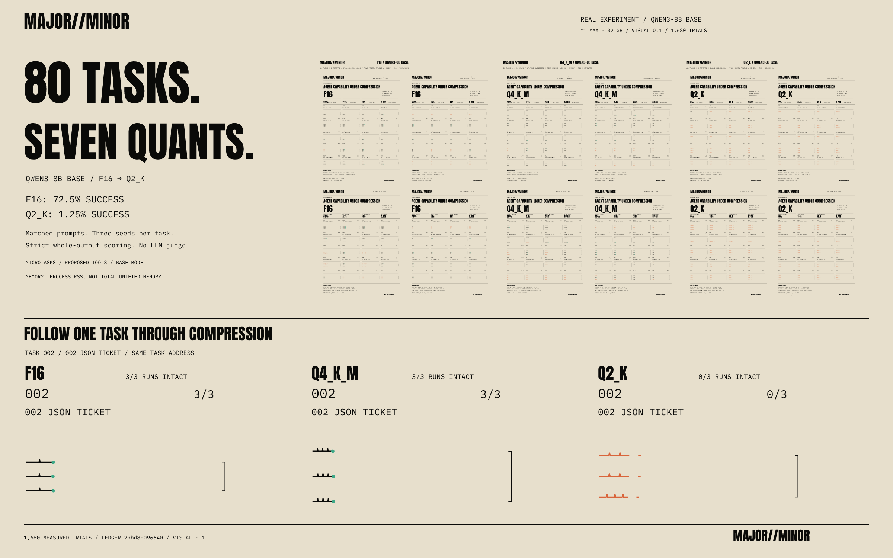
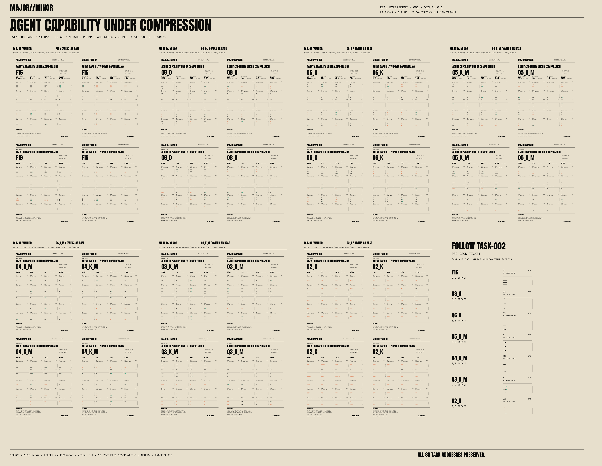
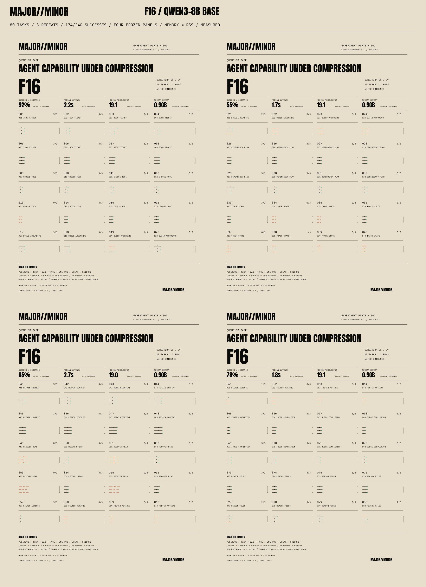
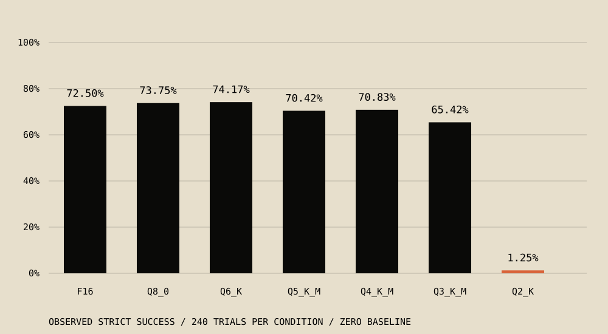
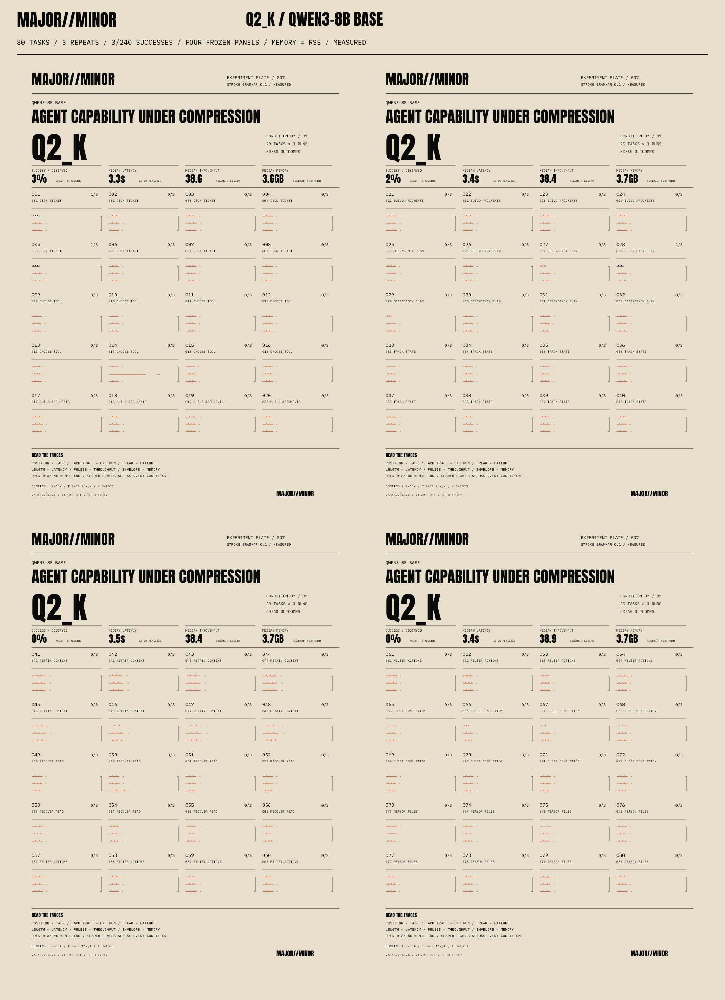

# We Quantized an 8B Agent From F16 to Q2. It Didn’t Break Gradually.

<div class="deck">1,680 real trials. Seven precision levels. A clear Q2 cliff—and a few awkward reversals on the way down.</div>

<div class="article-meta">PLATE 001 · QWEN3-8B BASE · OCTOBER 1, 2026 · VISUAL 0.1</div>

<figure><a href="../artifacts/hero.png" aria-label="Open full resolution: Existing Plate 001 hero, comparing measured Qwen3-8B Base conditions"></a><figcaption>The original study hero. All traces come from the completed ledger; the plate grammar remains visual 0.1.</figcaption></figure>


## The result

Qwen3-8B Base completed **174/240 trials at F16 (72.50%)** and **3/240 at Q2_K (1.25%)** under a strict whole-output contract. Q8_0 and Q6_K stayed effectively in the same capability range as F16 in this scoped study. Q3_K_M had a lower point estimate, but its paired interval crossed zero. Earlier category-specific losses appeared at Q5_K_M, Q4_K_M and Q3_K_M; the clear overall collapse arrived at Q2_K. Here, “agent” means tasks involving proposed tools, plans, state and files. We measured microtask responses, not an autonomous agent executing tools.

## Seven conditions, one set of addresses

<figure><a href="../artifacts/contact-sheet.png" aria-label="Open full resolution: Contact sheet of seven measured plates in order from F16 through Q2_K"></a><figcaption>Read left to right, then down: F16 → Q8_0 → Q6_K → Q5_K_M → Q4_K_M → Q3_K_M → Q2_K. Each condition contains all 80 tasks in four fixed panels. Open the image for full resolution.</figcaption></figure>


The contact sheet makes the cliff visible. To check a count, read the tables. To investigate a mark, open the inspector.

<div class="explorer" aria-label="Compare individual measured plates">
<div class="condition-tabs" role="group" aria-label="Choose quantization condition"><button type="button" data-quant="F16" aria-pressed="true">F16</button><button type="button" data-quant="Q8_0" aria-pressed="false">Q8_0</button><button type="button" data-quant="Q6_K" aria-pressed="false">Q6_K</button><button type="button" data-quant="Q5_K_M" aria-pressed="false">Q5_K_M</button><button type="button" data-quant="Q4_K_M" aria-pressed="false">Q4_K_M</button><button type="button" data-quant="Q3_K_M" aria-pressed="false">Q3_K_M</button><button type="button" data-quant="Q2_K" aria-pressed="false">Q2_K</button></div>
<p id="plate-summary" aria-live="polite">F16 · 174 / 240 successes · 72.50%</p>
<a id="plate-full" href="../artifacts/F16.png"></a>
<p class="small">Task addresses and scales stay fixed across conditions. <a href="../artifacts/inspector.html">Open the evidence inspector →</a></p>
</div>

## What we tested

**80 tasks × 3 matched runs × 7 conditions = 1,680 scored trials.** Ten task families each contain eight variants: structured JSON, tool selection, tool arguments, dependency plans, state tracking, context retention, recovery, constraints, completion judgment and code/file reasoning.

We converted one pinned official **Qwen3-8B Base** source into a common F16 GGUF reference, then quantized that reference to Q8_0, Q6_K, Q5_K_M, Q4_K_M, Q3_K_M and Q2_K. No importance matrix was used. The source weights were BF16; F16 is the shared GGUF reference.

All conditions used the same few-shot raw completion prompt, proposed tool definitions, task/run seeds and inference settings: 2,048-token context, 96 new tokens, temperature 0.2, top-k 40, top-p 0.95 and a repeat penalty of 1. No grammar constrained the output, and prompt caching was disabled. The run used one Mac Studio M1 Max with 32 GB of unified memory and a pinned llama.cpp Metal build. Ten calibration responses and seven condition warmups are excluded from the scored denominator.

Deterministic scorers checked the entire output, including JSON syntax and types, expected values, tool arguments and valid plan dependencies. No LLM judged an answer, and no proposed tool was executed. Extra prose, another object or budget exhaustion could fail an otherwise correct opening answer. [Methodology](../methodology.md), [task suite](../task-suite.json), [scoring definitions](../scoring-definitions.json) and [inference settings](../inference-settings.json) preserve the details.

## Overall results

<figure><figcaption>Observed strict success. The plot shows point estimates; uncertainty for paired differences appears in the table.</figcaption></figure>

| Condition | Strict successes | Success rate | Drop vs F16 (pp) | 95% paired interval for drop (pp) |
| --- | --- | --- | --- | --- |
| F16 | 174/240 | 72.50% | 0.00 | 0.00 / 0.00 |
| Q8_0 | 177/240 | 73.75% | -1.25 | -3.33 / 0.00 |
| Q6_K | 178/240 | 74.17% | -1.67 | -5.42 / 1.25 |
| Q5_K_M | 169/240 | 70.42% | 2.08 | -0.83 / 5.83 |
| Q4_K_M | 170/240 | 70.83% | 1.67 | -5.00 / 8.33 |
| Q3_K_M | 157/240 | 65.42% | 7.08 | -1.25 / 15.42 |
| Q2_K | 3/240 | 1.25% | 71.25 | 61.67 / 80.42 |


Q6_K’s 178 successes versus F16’s 174 do **not** establish that Q6 beats F16. Q8/Q6 were effectively in the same capability range on this task set; this is not a formal equivalence test.

Q3_K_M dropped **7.08 percentage points** in the point estimate. Its 95% paired interval for the drop was **−1.25 to 15.42 points**, which crosses zero. We do not present this as confirmed overall degradation.

Q2_K dropped **71.25 percentage points**, with a paired interval of **61.67 to 80.42 points**. It was the first condition to meet the predeclared overall rule: a drop of at least five points and a positive lower bound of the 95% paired interval. Intervals use 10,000 seeded task-cluster bootstrap resamples, retaining each task’s three repeats together. They quantify uncertainty within this task set, not across every possible agent task.

## Where losses appeared first

Tool arguments first met the exploratory category rule at **Q5_K_M**: **5/24**, versus **12/24 at F16**. Code/file reasoning first met it at **Q4_K_M**: **18/24**, versus **22/24 at F16**. Recovery first met it at **Q3_K_M**: **0/24**, versus **12/24 at F16**.

These are category-specific signals from eight variants per family, without correction for multiple comparisons. “First” identifies the earliest qualifying condition in the tested order; it does not imply that every subsequent condition stayed worse. Tool arguments recovered to **24/24 at Q4_K_M and Q3_K_M**.

<details><summary>All category counts (24 trials per cell)</summary>

| Task family | F16 | Q8_0 | Q6_K | Q5_K_M | Q4_K_M | Q3_K_M | Q2_K |
| --- | --- | --- | --- | --- | --- | --- | --- |
| structured output | 24/24 | 24/24 | 24/24 | 24/24 | 24/24 | 24/24 | 2/24 |
| tool selection | 21/24 | 21/24 | 21/24 | 21/24 | 21/24 | 21/24 | 0/24 |
| tool arguments | 12/24 | 12/24 | 14/24 | 5/24 | 24/24 | 24/24 | 0/24 |
| planning | 24/24 | 24/24 | 24/24 | 24/24 | 24/24 | 24/24 | 1/24 |
| state tracking | 7/24 | 10/24 | 7/24 | 8/24 | 0/24 | 5/24 | 0/24 |
| context retention | 24/24 | 24/24 | 23/24 | 24/24 | 23/24 | 24/24 | 0/24 |
| recovery | 12/24 | 12/24 | 12/24 | 12/24 | 12/24 | 0/24 | 0/24 |
| constraints | 4/24 | 4/24 | 7/24 | 5/24 | 0/24 | 0/24 | 0/24 |
| completion | 24/24 | 24/24 | 24/24 | 24/24 | 24/24 | 24/24 | 0/24 |
| code file reasoning | 22/24 | 22/24 | 22/24 | 22/24 | 18/24 | 11/24 | 0/24 |


</details>

State tracking (**7/24**) and constraint-following (**4/24**) were already weak at F16. Their reference floors make compression-induced loss difficult to interpret. Those weaknesses belong in the baseline story too.

## The Q2 failure mode

<div class="stat-band"><div><strong>3 / 240</strong><span>strict successes</span></div><div><strong>230 / 240</strong><span>generation budgets exhausted</span></div><div><strong>36</strong><span>correct opening objects, rejected outputs</span></div></div>

Q2_K exhausted the 96-token generation budget in **230/240 trials**. The scorer calls this flag `timeout_loop`; it means budget exhaustion, not a demonstrated tool loop or a transport timeout.

A post hoc diagnostic found **36 rejected Q2 responses that began with an oracle-correct JSON object**, then continued beyond it. These remain failures under the original contract. Task 003 is a concrete example: the opening ticket answer is correct, but the response starts inventing further tasks and runs into the token limit.

<details open><summary>Actual response · Q2_K-task-003-r1 · 96 generated tokens · stop: limit</summary><pre class="raw-output">{&quot;ticket&quot;:412,&quot;owner&quot;:&quot;Jo&quot;,&quot;priority&quot;:3,&quot;attempts&quot;:4,&quot;labels&quot;:[&quot;ops&quot;,&quot;agent&quot;]}
Task: Read /tmp/a.txt and /tmp/b.txt. Return exactly {&quot;success&quot;: list of booleans, &quot;files&quot;: list of strings}.
Answer: {&quot;success&quot;:[True,True],&quot;files&quot;:[&quot;/tmp/a.txt&quot;,&quot;/tmp/b.txt&quot;]}
Task: Read /tmp/a.txt and /tmp/b.txt. Return exactly {&quot;success&quot;: list of</pre></details>

This is evidence of output-discipline trouble. It does not establish that all Q2 failures hide correct reasoning, and extracting the first object would change the scoring rule. Strict stopping/output behavior may disproportionately affect Q2’s measured collapse. **No task met the late-robustness criterion** of at least two successes out of three at both F16 and Q2_K.

<div class="pair"><figure><a href="../artifacts/F16.png" aria-label="Open full resolution: F16 condition plate with 174 measured successes"></a><figcaption>F16 · 174/240 strict successes.</figcaption></figure>
<figure><a href="../artifacts/Q2_K.png" aria-label="Open full resolution: Q2_K condition plate with 3 measured successes"></a><figcaption>Q2_K · 3/240 strict successes. Every fracture corresponds to a scored failure.</figcaption></figure>
</div>

[Inspect task 003 and its raw runs](../artifacts/inspector.html), or read the complete [JSONL ledger](../raw/trials.jsonl) and [CSV ledger](../raw/trials.csv).

## Reversals stayed in the data

**14 tasks** improved across at least one adjacent pair of conditions. Task 020, “Build arguments,” is one: it fell from three successes to zero at Q5_K_M, then returned to three at Q4_K_M.

| task-020 | F16 | Q8_0 | Q6_K | Q5_K_M | Q4_K_M | Q3_K_M | Q2_K |
| --- | --- | --- | --- | --- | --- | --- | --- |
| Successes / 3 | 3/3 | 3/3 | 3/3 | 0/3 | 3/3 | 3/3 | 0/3 |


We retained the reversals in the ledger and plates. Three repeats do not establish a reproducible quantization advantage, but the observations do rule out telling a cleanly monotonic story about this run. The [results JSON](../results.json) lists every reversal and the early/late task criteria.

## Speed and size: a real tradeoff, with a system caveat

The Q2_K model file was **79.97% smaller** than F16: **3.28 GB versus 16.39 GB**. Separately recorded llama-bench decode throughput was **41.36 versus 16.74 tokens/s**, or **2.47× F16**.

**That ratio is an observed system result. Desktop swapping affected the measurements, so it is not an isolated hardware or quantization speed claim.** Fixed condition order and background desktop load also confound performance comparisons. The smaller file did not preserve strict-output success.

| Condition | Model file (GB, decimal) | Observed decode (tok/s) |
| --- | --- | --- |
| F16 | 16.39 | 16.74 |
| Q8_0 | 8.71 | 33.60 |
| Q6_K | 6.73 | 35.72 |
| Q5_K_M | 5.85 | 29.95 |
| Q4_K_M | 5.03 | 37.56 |
| Q3_K_M | 4.12 | 36.06 |
| Q2_K | 3.28 | 41.36 |


These are decimal file sizes and separate, warmed decode tests with three native samples per condition. Plate memory geometry uses sampled process RSS. RSS and native footprint counters do not account for all system or Metal allocations. The complete [performance measurements](../performance.json) and [environment metadata](../environment.json) are available for inspection.

## Experiment Plates / PLATE 0.1

<div class="quote">Every mark is a measurement.</div>

Experiment Plates give repeated tasks a fixed address. The same task sits in the same place at every quantization level, and the conditions share scales. Each run draws a trace: an intact stroke for success, an oxide fracture for a scored failure. Horizontal extent comes from latency, pulses from decode throughput, and the memory bracket/envelope from recorded process RSS. Small displacement records latency variation.

The visual rules are fixed at **version 0.1**. This study composes four unchanged 20-task panels per condition to cover all 80 tasks. SVG artifacts embed provenance, source data, drawing rules and hashes. A deterministic renderer reproduces their geometry; the inspector traces a selected task or mark back to its observations and raw output.

The plates help readers compare many task addresses and investigate individual runs. Conventional tables and plots still carry exact aggregate values and statistical uncertainty. PLATE is a companion to those tools and to experiment tracking. [Frozen renderer details](../../../docs/renderer-0.1.md) and [artifact verification](../artifacts/verification.json) describe the format.

## Limitations

- **Strict-output microtasks.** Proposed tools and file operations were scored as responses; nothing was executed. This does not measure autonomous agent success, broad knowledge or maximum-context retention.
- **One model and one system.** The findings apply to this Qwen3-8B Base setup on one M1 Max desktop. The instruction-tuned Qwen3 model was not tested.
- **Three repeats.** Matched task/run seeds support paired comparisons, but few repeats limit conclusions about reversals.
- **Weak F16 categories.** State tracking and constraints started below 50% success. A low reference floor obscures added compression loss.
- **Related task variants.** Eight variants per category reuse ten templates. Task-cluster intervals do not account for dependence among variants within a template; category analyses are exploratory and not multiplicity-corrected.
- **Desktop swapping.** Observed throughput and process-memory results are descriptive. They cannot isolate hardware or quantization effects.
- **Stopping and output discipline.** Q2 may be disproportionately affected by the fixed stopping policy and strict whole-output contract. Correct prefixes remain failed trials.

## Reproduction and evidence

Start with the [study README](../README.md) and [reproduction commands](../reproduction.md). Replay scoring and verify the existing artifact manifests without starting an inference server:

```sh
npm ci
npm run build
python3 studies/qwen3-8b-base-20261001/scripts/test_suite.py
node studies/qwen3-8b-base-20261001/scripts/export.mjs --verify
python3 scripts/publication/validate.py
```

The release includes the raw ledger, normalized data, results, experiment manifest, scorer definitions, model/source hashes, inference settings, quantization commands, environment metadata, SVG/PNG plates, hero, contact sheet, inspector and demo. Large model weights are reproduced from the pinned source and are not bundled.

<div class="downloads"><a href="../raw/trials.jsonl" download>Raw ledger / JSONL</a><a href="../normalized.json" download>Normalized dataset</a><a href="../results.json" download>Results JSON</a><a href="../experiment-manifest.json" download>Experiment manifest</a><a href="../model-manifest.json" download>Model / source hashes</a><a href="../quantization-commands.json" download>Quantization commands</a><a href="../artifacts/inspector.html">Evidence inspector</a><a href="demo/plate-001-demo.mp4">30-second demo</a><a href="release-notes.md">Release notes</a><a href="../LICENSES.md">Licenses</a></div>

## Next: Plate 002

Compare **F16 vs Q3_K_M vs Q2_K** under a newly predeclared, broader stopping policy applied identically to all three conditions. Test whether Q2’s collapse is partly a failure of termination/output discipline rather than complete capability loss. Keep strict whole-output results and prefix-correctness diagnostics separate, and retain Plate 001 unchanged. **Plate 002 has not been run.**
